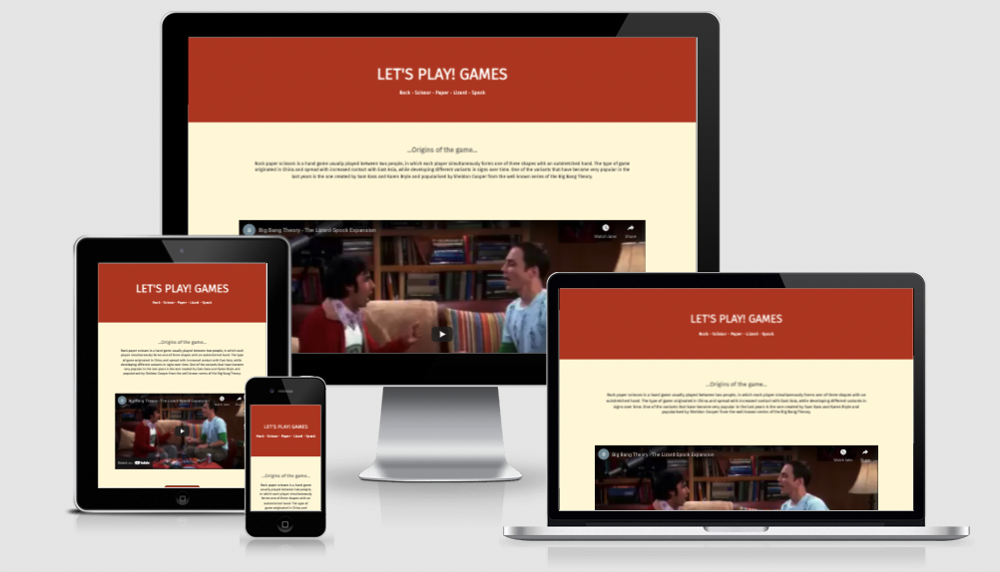
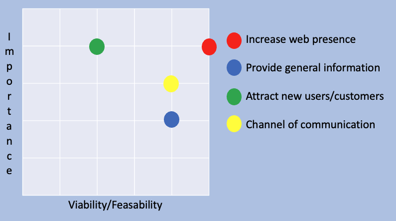

# Let'sPlay!Rock-Paper-Scissors-Lizzard-Spock

[View the page on github here](https://anag0307.github.io/rock-paper-scissor/)

## Table of Contents

1. [Introduction](#Introduction)

2. [UX](#UX)

    i. [Ideal User Demographic](#Ideal-User-Demographic)

    ii. [User Stories](#User-Stories)

    iii. [Design Planes](#Design-Planes)

3. [Features](#Features)

    i. [Navigation Bar](#Navigation-Bar)

    ii. [Landing Page Image](#Landing-Page-Image)

    iii. [Home Section](#Home-Section)

    iv. [Footer](#Footer)

    v. [Gallery](#Gallery)

    vi. [Create your Order](#Create-Your-Order)

    vii. [Contact](#Contact)

4. [Testing, Validation and Deployment](#Testing-and-Deployment)

    i. [Testing](#testing)

    ii. [Validation](#Validation)

    ii. [Deployment](#deployment)

5. [Issues and Bugs](#Issues-and-Bugs)

6. [Technologies Used](#Technologies-Used)

7. [Credits](#Credits)

***

## Introduction

(...)

[Back to Top ⇧](#Let'sPlay!Games) 

***

## UX

### Ideal User Demographic 
#### The ideal user of this website is:
- (...)

### User Stories
#### New and potential users goals:
- (...)

#### Current Social Media Followers
- (...)

[Back to Top ⇧](#Let'sPlay!Rock-Paper-Scissors-Lizzard-Spock) 

***

### Design Planes

(...)

#### **Strategy**

##### Who is this website for and what does it do?

1. Demographics:
    1. (...)

2. Functional Requirements:
    1. (...)

3. Benefits for the artist:
    1. (...)

4. Importance/Feasability Curve

#### **Scope**

In order to align the features defined in the strategy section, the scope was divided in two categories:

**Content Requirements**

The user will be looking for:

- (...)

**Functionality Requirements**

- (...)

#### **Structure**

The website is been organised in a way the user can find the different sections in a strcutured but also relevant way. The results are as follows:

#### **Skeleton**

How is the information represented and how does the user find such information:

- (...)
- Wireframe mockups were created in [Figma](https://www.figma.com/file/ECj7IYln3FYai5damrGpnC/Rock%2C-paper%2C-scissor%2C-lizard%2C-Spock?node-id=0%3A1 "Link to Figma") to ensure the structure represented all the requirements described above (different versions were created).

#### **Surface**

- (...)

[Back to Top ⇧](#Let'sPlay!Rock-Paper-Scissors-Lizzard-Spock) 

***

## Features

(...)

[Back to Top ⇧](#Let'sPlay!Rock-Paper-Scissors-Lizzard-Spock) 

***

## Testing and Deployment

### Testing

General testing [video on Youtube (external link)](https://www.you... "Adriana Crafter general testing video"). 

The observations are as follows:

- (...)

### Validation

No errors have been found when checking HTML and CSS code. To validate the code the developer has used:

- [Jigsaw](https://validator.w3.org/ "link to the validator website for CSS")

- [W3C](https://validator.w3.org/#validate_by_input "link to the validator website for HTML")

### Deployment

This project was developed using [Visual Studio Code Insiders](https://code.visualstudio.com/insiders/ "Link to Visual Studio Code site") and all commit/push commands were performed in the software's terminal.

#### Github Pages

1. Log into [GitHub](https://github.com/ "link to GitHub website").

2. Select the repositery to deploy.

3. Click on Settings tab.

4. Scroll down to the GitHub Pages section under Source and open it, it will open in a different tab.

5. Select "Branch: master" and then on the new dropdown menu that will appear select "/(root)" and click Save.

6. The "Github Pages" section now contains a link to the deployed page.

#### Forking the Repository

1. Log into [GitHub](https://github.com/ "link to GitHub website").

2. Select the repository to fork.

3. Click on "Fork".

[Back to Top ⇧](#Let'sPlay!Rock-Paper-Scissors-Lizzard-Spock) 

***

### Issues and Bugs

(...)

[Back to Top ⇧](#AdrianaCrafter) 

***

## Technologies Used

### Main Languages Used

- [CSS](https://en.wikipedia.org/wiki/CSS)

- [HTML](https://en.wikipedia.org/wiki/HTML)

- [JavaScript](https://en.wikipedia.org/wiki/JavaScript)

### Frameworks, Libraries and Programs Used

- [Font Awesome](https://fontawesome.com/ "Link to FontAwesome") was used.
- [Unicorn Revealer](https://chrome.google.com/webstore/detail/unicorn-revealer/lmlkphhdlngaicolpmaakfmhplagoaln "link to Unicorn Revealer") was used to identify the overflows on the website.
- [GitHub](https://github.com/ "Link to GitHub") was used to store the project.
- [Figma](https://www.figma.com/ "Link to Figma homepage") was used to create the wireframes during the design phase of the project.
- [Am I Responsive?](http://ami.responsivedesign.is/# "Link to Am I Responsive Homepage") was used to see responsive design throughout the process and to generate mockup imagery to be used on README file.
- [Unsplash](https://unsplash.com/ "link to Unsplash") was used for the picture used in the Whats is A dreamcatcher section.

[Back to Top ⇧](#Let'sPlay!Rock-Paper-Scissors-Lizzard-Spock) 

***

## Credits

### Code

The below sites were consulted by the developer to better understand the JavaScript code. Any code used from those sites have been carefully referenced with the code.

The sites consulted are:

- [w3Schools](https://www.w3schools.com/ "link to w3s")

- [Stack Overflow](https://stackoverflow.com "link to Stack Overflow")

- [CSS Tricks](https://css-tricks.com/ "link to CSS Tricks")

### Media

The images were sourced from [Unsplash](https://unsplash.com/ "link to Unsplash").

[Back to Top ⇧](#Let'sPlay!Rock-Paper-Scissors-Lizzard-Spock) 

### Acknowledgements

(...)

[Back to Top ⇧](#Let'sPlay!Rock-Paper-Scissors-Lizzard-Spock) 
